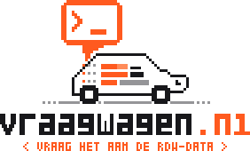

  

<h3 align="center">Ask the Dutch vehicle registry — in plain language.</h3>

  <a href="https://vraagwagen.nl"><strong>vraagwagen.nl</strong></a> lets you query all <strong>16 million</strong> registered Dutch vehicles
  by simply asking a question. No SQL, no datasets, no spreadsheets — just type what you want to know.

---

## 💬 What can you ask?

Anything the RDW knows about vehicles in the Netherlands:

> *How many white Volkswagen Ups from February 2017 are insured?*

> *What's the average catalog price of a Tesla Model 3?*

> *Which car colors became more popular over the last ten years?*

> *Tell me about license plate `GT-344-L`.*

You'll get back a clear answer — a number, a chart, a time series, or a vehicle card — straight from **live RDW open data**, with a short explanation of *why* you got this result and suggested follow-up questions to keep exploring.

## ⚙️ How it works

1. **You ask** a question in plain English or Dutch.
2. **AI translates** it into a precise query plan against the official [RDW Open Data](https://opendata.rdw.nl) platform.
3. **The registry answers** — your question runs directly on live data, and the result is rendered as the visual that fits best.

A nice detail: the AI never sees the vehicle data itself. It only writes the *plan* — the actual numbers come untouched from the source. That keeps answers fast, cheap, and honest.

## ✨ Features

- 🗣️ **Plain-language queries** — English and Dutch
- 📊 **Smart visuals** — counts, distributions, time series, and vehicle cards
- 🇳🇱 **Live data** — every answer comes straight from the RDW, never from a cache of yesterday
- 🔍 **Transparent** — every result explains how it was computed, with a link to the source dataset
- 🔗 **Shareable** — copy a link to any answer
- 💡 **Follow-up suggestions** — one question leads to the next

## 🛠️ Under the hood

Built with [Laravel](https://laravel.com), [React](https://react.dev) + [Inertia](https://inertiajs.com), [Tailwind CSS](https://tailwindcss.com), and [Laravel AI](https://github.com/laravel/ai) — on top of the [`nieknijland/rdw-opendata-php`](https://github.com/nieknijland/rdw-opendata-php) package.

## 🎨 Brand

The full pixel-art brand set lives in [`public/images/brand/`](public/images/brand/):

| | |
|:---:|:---:|
|  |  |
| `icon.svg` | `wordmark.svg` |

---

  Made with ❤️ in the Netherlands · Data © <a href="https://opendata.rdw.nl">RDW Open Data</a>

